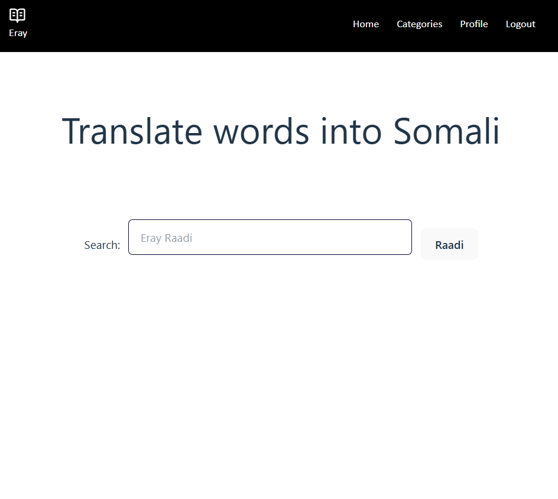
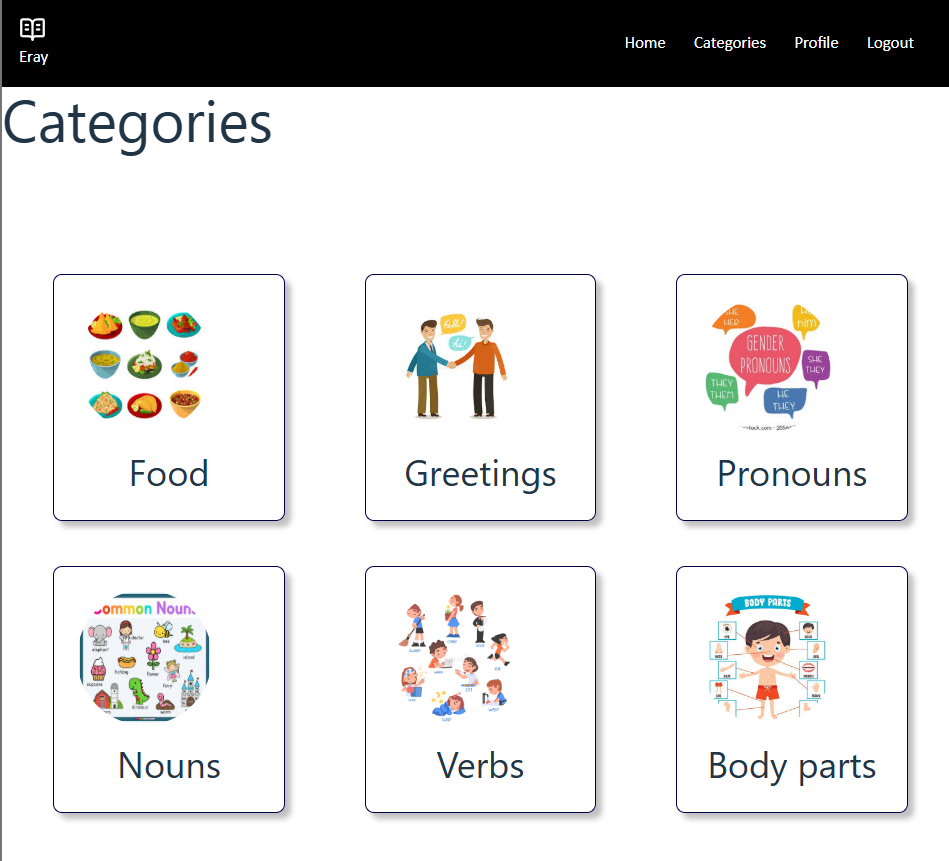
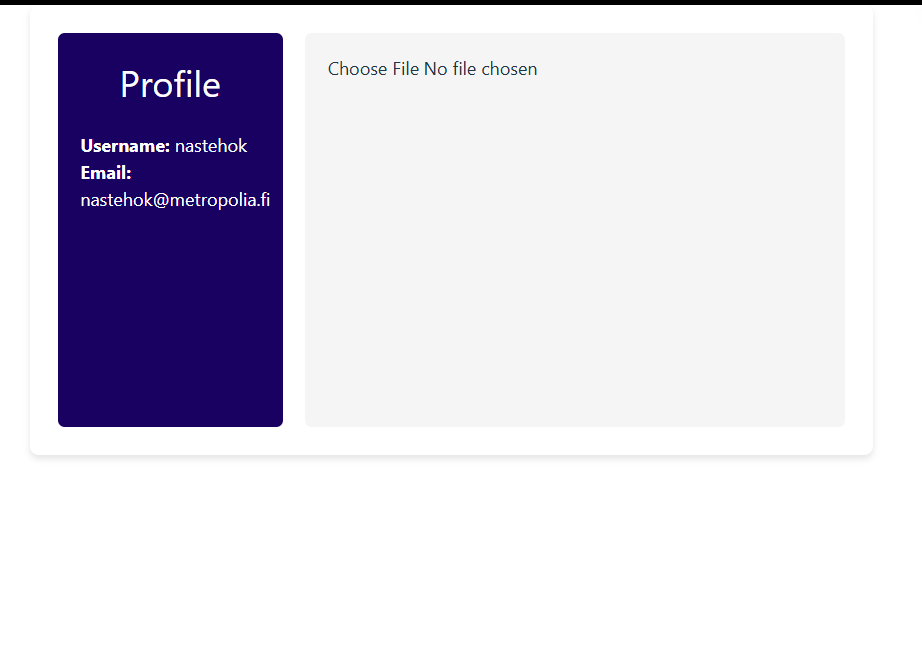
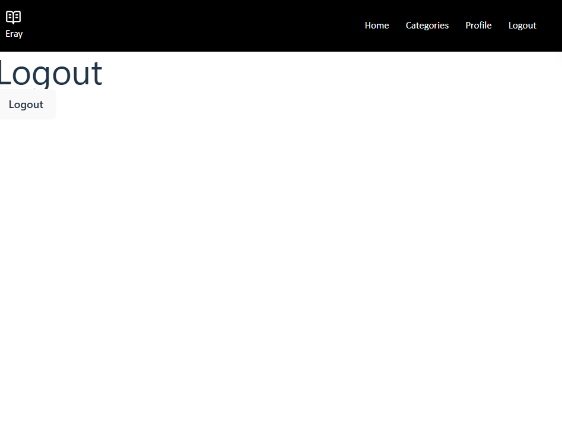
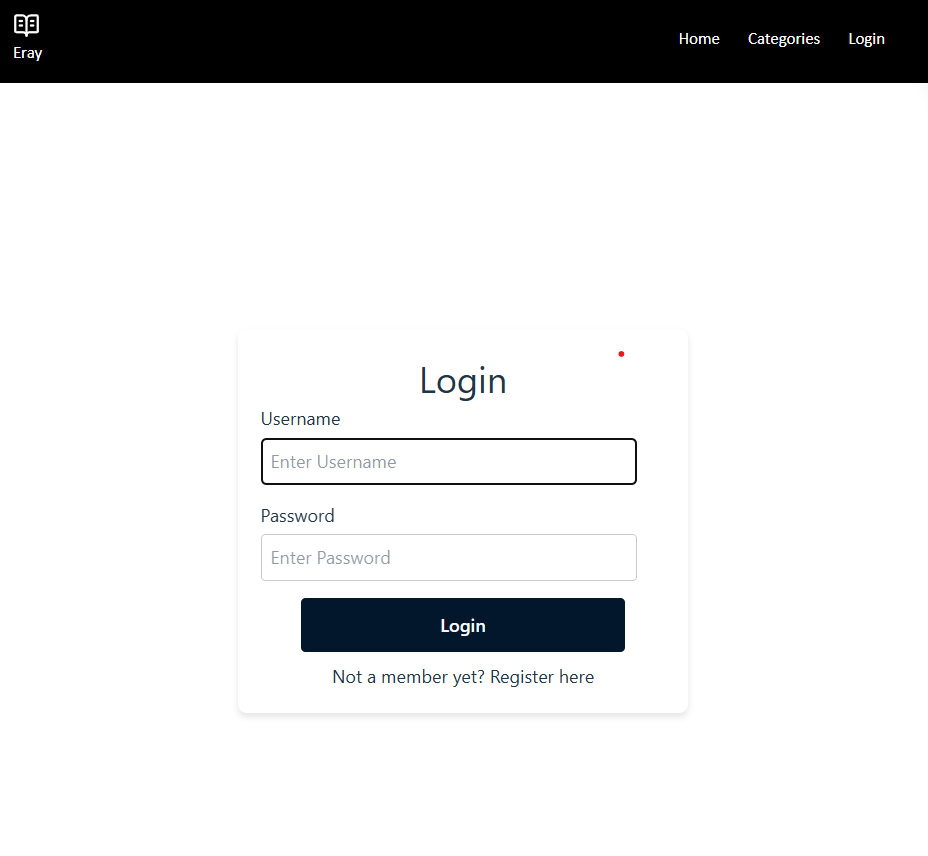

# React + TypeScript + Vite

This template provides a minimal setup to get React working in Vite with HMR and some ESLint rules.

Currently, two official plugins are available:

- [@vitejs/plugin-react](https://github.com/vitejs/vite-plugin-react/blob/main/packages/plugin-react) uses [Babel](https://babeljs.io/) (or [oxc](https://oxc.rs) when used in [rolldown-vite](https://vite.dev/guide/rolldown)) for Fast Refresh
- [@vitejs/plugin-react-swc](https://github.com/vitejs/vite-plugin-react/blob/main/packages/plugin-react-swc) uses [SWC](https://swc.rs/) for Fast Refresh

## React Compiler

The React Compiler is enabled on this template. See [this documentation](https://react.dev/learn/react-compiler) for more information.

Note: This will impact Vite dev & build performances.

## Expanding the ESLint configuration

If you are developing a production application, we recommend updating the configuration to enable type-aware lint rules:

```js
export default defineConfig([
  globalIgnores(['dist']),
  {
    files: ['**/*.{ts,tsx}'],
    extends: [
      // Other configs...

      // Remove tseslint.configs.recommended and replace with this
      tseslint.configs.recommendedTypeChecked,
      // Alternatively, use this for stricter rules
      tseslint.configs.strictTypeChecked,
      // Optionally, add this for stylistic rules
      tseslint.configs.stylisticTypeChecked,

      // Other configs...
    ],
    languageOptions: {
      parserOptions: {
        project: ['./tsconfig.node.json', './tsconfig.app.json'],
        tsconfigRootDir: import.meta.dirname,
      },
      // other options...
    },
  },
])
```

You can also install [eslint-plugin-react-x](https://github.com/Rel1cx/eslint-react/tree/main/packages/plugins/eslint-plugin-react-x) and [eslint-plugin-react-dom](https://github.com/Rel1cx/eslint-react/tree/main/packages/plugins/eslint-plugin-react-dom) for React-specific lint rules:

```js
// eslint.config.js
import reactX from 'eslint-plugin-react-x'
import reactDom from 'eslint-plugin-react-dom'

export default defineConfig([
  globalIgnores(['dist']),
  {
    files: ['**/*.{ts,tsx}'],
    extends: [
      // Other configs...
      // Enable lint rules for React
      reactX.configs['recommended-typescript'],
      // Enable lint rules for React DOM
      reactDom.configs.recommended,
    ],
    languageOptions: {
      parserOptions: {
        project: ['./tsconfig.node.json', './tsconfig.app.json'],
        tsconfigRootDir: import.meta.dirname,
      },
      // other options...
    },
  },
])
```


Toiminnallisuudet: 
Login, Register ja Logout
Search
Profiili

Api dokumentaatio: 
file:///C:/Users/naste/Erayy/Eray/server/docs/index.html


Bugit/Ongelmat
Tiedoston lataus:
Kuvat ovat teksti formaatissa

Backend&API URL:
http://localhost:8000
http://localhost:8000/api/Word

Tietokanta
Words -taulu, joka varastoi sanoja, käännöksiä, esimerrki lauseita ja kategoroioita
bookmarks -taulu joka liittää käyttäjän heidän kirjamerkkeihinsä


Screenshotit:
Home

Categories 

Profile

Logout 

Login

Register


Projektissa käytetyt materiaalit
Search
CSS: Scrimban CSS kurssi
TypeScript ja React
https://www.youtube.com/watch?v=Kff25n75jqA


Register, Login ja Profiili
CSS: https://www.youtube.com/watch?v=M3XrYq8075A
Typescript ja React: Kurssimateriaalien mukaan 
https://medium.com/@amolakapadi/building-a-simple-login-form-with-show-password-toggle-in-react-ccc078044dd7

https://www.sammeechward.com/use-context-auth

Categories
CSS: https://www.youtube.com/watch?v=yYiwxYqQ9vg
https://www.w3schools.com/css/css_grid.asp
Database ja Apit: sovellettu Scrimba fullstack express.js kurssi
Typescript ja React: -En ehtinyt

Database
sovellettu Scrimban Fullstack Express.js kurssi


Favorites: -En ehtinyt

Upload Profiilissa
Kurssimateriaalien week03 mukaan 
https://www.youtube.com/watch?v=pWd6Enu2Pjs
https://developer.mozilla.org/en-US/docs/Web/API/Fetch_API/Using_Fetch

Profiilin tyylitys
Css: 
https://www.youtube.com/watch?v=yYiwxYqQ9vg


Navigaatio
CSS: https://www.youtube.com/watch?v=-Yw9gBHE60E
Muu: kurssimateriaalien mukaan

Ai:n käyttö vielä erikseen
seedTable.ts (Oma Json file, jolla chatgpt loi seedit)
Debuggaus esim Login, Registerin ja search:n yhteydessä
CSS login, search categories container korjaaminen
Apihooks useUser()
